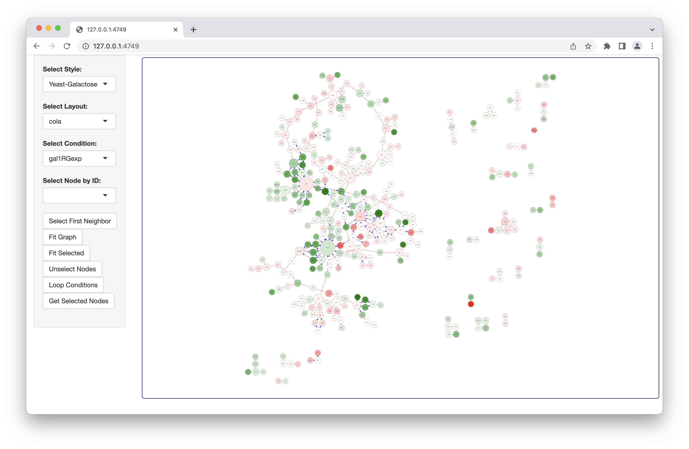

## cyjShiny

cyjShiny is a Shiny widget based on [htmlWidgets](http://www.htmlwidgets.org/index.html) for network visualization using [cytoscape.js](https://js.cytoscape.org/).

## Installation
### From CRAN (Stable Version) 

Users should start with CRAN as it is the most stable version: 

```
install.packages("cyjShiny") 
```

### Install from GitHub (Development Version) 
```
library(remotes)
remotes::install_github(repo="cytoscape/cyjShiny", ref="master", build_vignette=TRUE)
```

### Compile cytoscape.js (Javascript Development) 

[Instructions](https://github.com/cytoscape/cyjShiny/wiki/installation) for compiling cytoscape.js for use with htmlWidgets. NOTE: This should only be used by those actively modifying [cytoscape.js](https://js.cytoscape.org/).

## Quick Start (First cyjShiny App)

* [Shiny Development Basics](https://shiny.rstudio.com/tutorial/) 
* [Shiny Extensions for Embedding Javascript Visualizations](https://shiny.rstudio.com/articles/htmlwidgets.html)
* Get Help: `help(package="cyjShiny")`
  * Main available features: layouts, node selection, styling, save to PNG, fit graphs to display area
* Quick Start Example: 

```
library(shiny)
library(cyjShiny)
library(graph)
library(jsonlite)

# NETWORK DATA ----
tbl_nodes <- data.frame(id=c("A", "B", "C"), 
                        size=c(10, 20, 30),
                        stringsAsFactors=FALSE)

# Must have the interaction column 
tbl_edges <- data.frame(source=c("A", "B", "C"),
                        target=c("B", "C", "A"),
                        interaction=c("inhibit", "stimulate", "inhibit"),
                        stringsAsFactors=FALSE)

graph_json <- toJSON(dataFramesToJSON(tbl_edges, tbl_nodes), auto_unbox=TRUE)

# UI ----
ui <- fluidPage(cyjShinyOutput('cyjShiny'))

# SERVER ----
server <- function(input, output, session) {
  output$cyjShiny <- renderCyjShiny({
    # Layouts (see js.cytoscape.org): cola, cose, circle, concentric, grid, breadthfirst, random, fcose, spread
    cyjShiny(graph_json, layoutName="cola")
  })
}

# RUN ----
shinyApp(ui=ui, server=server)
```

## Styling 

Many of the visual properties of a network can be stylized. 

* [Styling Documentation](https://js.cytoscape.org/#style)
* Example Styling (`data()` maps data dynamically to specify a property value from the input data.frame):

```
[
  {"selector":"node", "css": {
    "border-width": "2px",
    "width": "data(size)",
    "height": "data(size)", 
    "content": "data(id)"
  }},
  {"selector": "edge[interaction='stimulate']", "css": {
    "line-color": "green"
  }},
  {"selector": "edge[interaction='inhibit']", "css": {
    "line-color": "red"
  }}
]
```
* Styling Usage with Quick Start Example: 

Save the example styling to a file `style.js` in the current working directory and replace `cyjShiny()` in the Quick Start example as shown below:

```
cyjShiny(graph_json, layoutName="cola", styleFile="style.js")
```

## Demos

* Try [basicDemo Demo](https://cannin.shinyapps.io/cyjShiny/) on [shinyapps.io](https://www.shinyapps.io/)
* [basicDemo Code](https://github.com/cytoscape/cyjShiny/tree/master/inst/demos/basicDemo)
* Other Demos: 
  * quickStartDemo: Demo used in README; [Code](https://github.com/cytoscape/cyjShiny/tree/master/inst/demos/quickStartDemo)
  * rmarkdownDemo: Demo for cyjShiny use in R Markdown files; [Code](https://github.com/cytoscape/cyjShiny/tree/master/inst/demos/rmarkdownDemo)
  * dataFrameGraphWithPresetNodePositions: Use preset layout to set node positions; [Code](https://github.com/cytoscape/cyjShiny/tree/master/inst/demos/dataFrameGraphWithPresetNodePositions)
  * fromCytoscapeDesktop: Load and visualize networks generated in Cytoscape Desktop; [Code](https://github.com/cytoscape/cyjShiny/tree/master/inst/demos/fromCytoscapeDesktop)
  * saveAndRestoreLayout: Within a session, save node positions and restore positions for nodes moved after positions saved; [Code](https://github.com/cytoscape/cyjShiny/tree/master/inst/demos/saveAndRestoreLayout)
  * withDT: Include at DT table of node values along with the graph visualization; [Code](https://github.com/cytoscape/cyjShiny/tree/master/inst/demos/withDT)

<p align="center">
 
</p>
